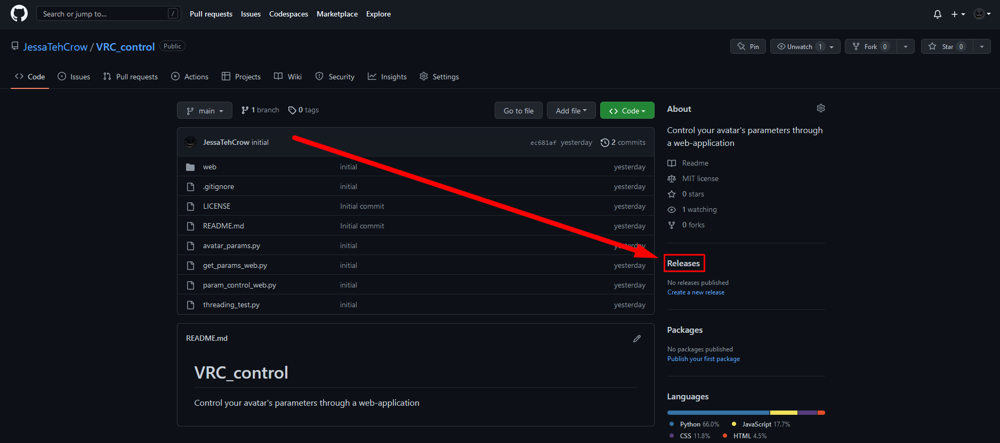
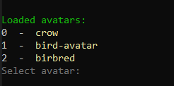
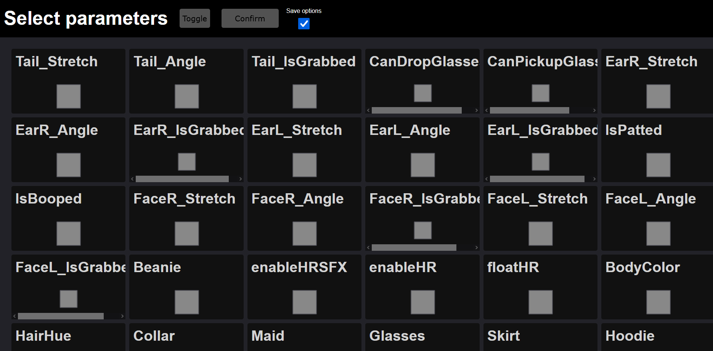
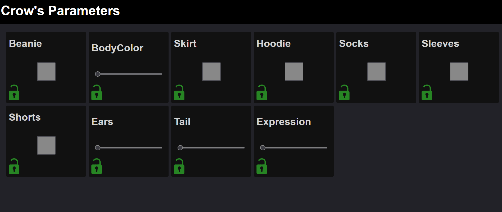
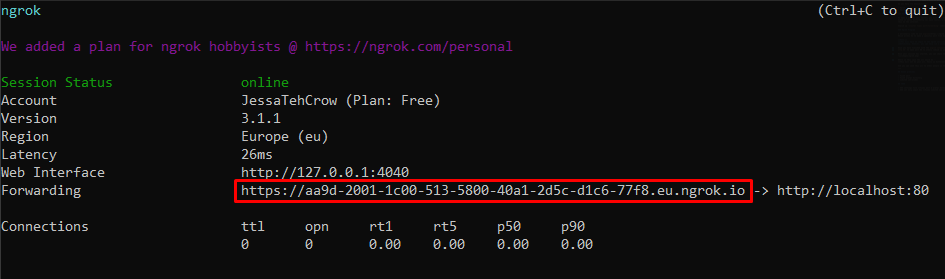

# VRC_control
Control your avatar's parameters through a web-application

## Features

- ***EVERY*** sdk3 avatar is compatible
- Lock toggles and sliders
- Set avatar toggles from your browser
- Share across the internet

*Examples:*

https://user-images.githubusercontent.com/29403110/221006121-2cdabd1f-5e5d-4e82-b9d2-073616d3303d.mp4
___

## How to install

#### Executable only

Go to the [releases](https://github.com/JessaTehCrow/VRC_control/releases) for this repository and download the latest release

Unpack the ZIP into a folder and run the .Exe

#### Repo clone

After you have cloned the repository, you can install the python dependecies using `pip -r requirements.txt` while in the directory of the repository.

After this is installed, you can go to the `src` folder, and run `main.py` with python >= 3.8

___

## How to use

Upon starting the program, you will be prompted with which avatar you would like to choose within the terminal:

You can select an avatar by typing the number infront of the name of the avatar you want to choose and pressing enter.

**Note:**
***If you have loaded this avatar before and have saved the settings, you will be prompted whether or not you want to load the save, or redo the setup.***

Open your web-browser and go to http://localhost (Only you can see this, no one else can).
Here, input which parameters / toggles you want to be able to change.

After you have selected all of your parameters, click on confirm and potentially `save options` to prevent the last step next time.

The page will refresh and load into the page where you can change the values.

___

## Sharing control with other people

You will have to either open a port on your router, or use a program to open your local network to others.

#### Port Forwarding

To open a port on your router, you will have to port-forward the tcp port 80 on your router.
Since it works differently for each router, i cannot make a standardized guide for this, you can find this on the internet. 

Search up `[router type] port-forwarding` (where `[router type]` is your router) on google or youtube.

#### Ngrok Program

I personally like to use [ngrok](https://ngrok.com/download). 
Which allows me to open a specific port from my computer to the internet using a simple to use program.

**Note:**
***You don't need to sign up for Ngrok to use it, however the session will expire in 2 hours if you do not, forcing you to restart the session. Signing up with a free account prevents this.***

Once installed, you can open a new commandline (`windows key + r` and type `cmd`).
When your commandline has opened, you can type `ngrok tcp 80` to open port 80 to others (which is what we need now).

Once your session has started, you can share the url with other people. Replace `tcp://` with `http://`

Where in this case the url would be `http://5.tcp.eu.ngrok.io:13218` 
*(This will not be your url. Yours is different)*

And you can send this url to other people so they can access it too.
___

## Known problems

- Fixed port
- Fixed avatar directory
- Limited int-slider

## TODO

- Add settings file *(fixes port & avatar directory)*
- Add int only input box *(Fixes Limited int-slider)*