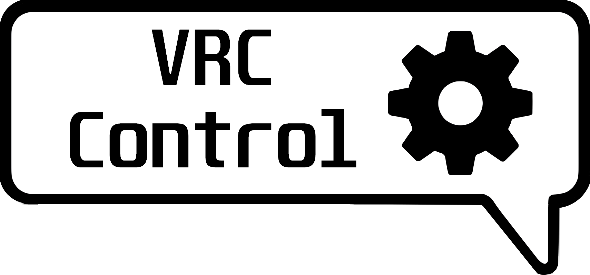

# VRC Control

`Vrc control is a simple to use desktop application to control your avatar parameters to the web`

___

This project is created for the sole reason of letting other people control / lock the parameters of your avatar through a simple web application, while also maintaining the least amount of setup possible to make it work.

This is a second rendition of this project, and a much easier to use version.

## Installing

go to releases idiot

## Compatibility

VRC Control is compatible with every single skd3 avatar on vrchat. Including public avatars found in avatar worlds, without any additional setup.

> [!NOTE]  
> This program does not rip avatars, it merely reads the OSC data supplied by vrchat itself!

It will also work with any other OSC program that interacts with vrchat.
Such as:

- [VRCDiscordMute](https://github.com/I5UCC/VRCDiscordMute)
- [VRChatSpotifyControler](https://github.com/Jakhaxz/VRChatSpotifyControler)
- [VRCMeeter](https://github.com/I5UCC/VRCMeeter)
- Etc...

## Limits

- You will have to re-create a lobby when switching avatars

## FAQ

. . .

## Known issues

- Connectivity issues
- Bigger web UI for VR users

## Special thanks

#### Alpha testers

Purpleleven
