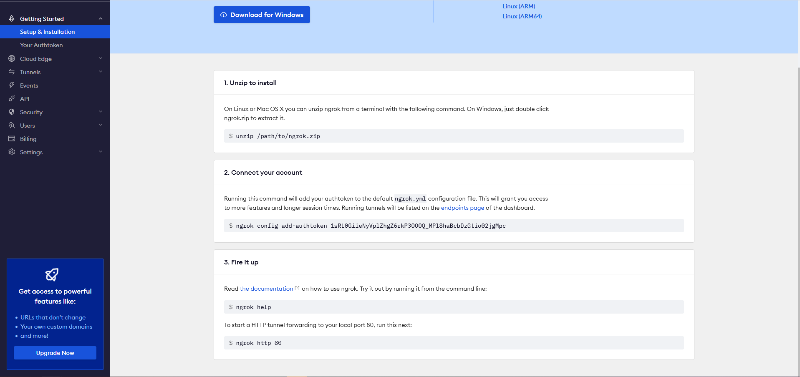
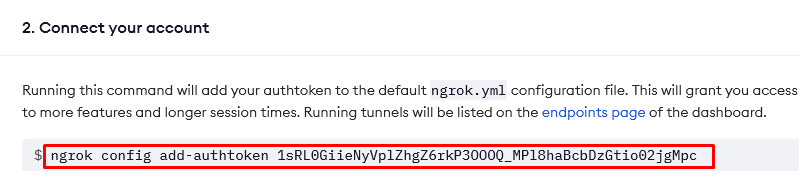
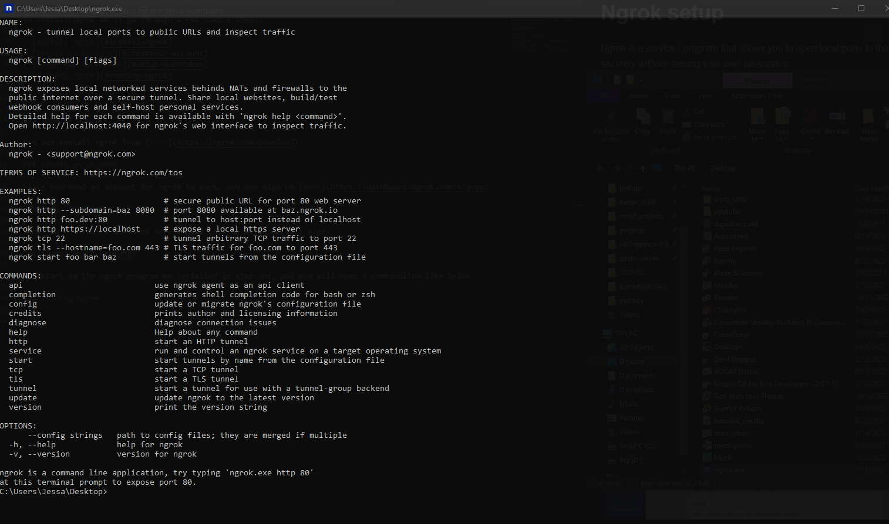
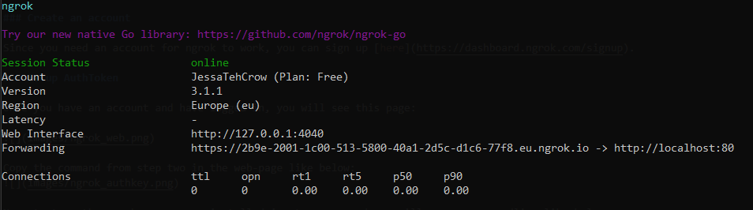

# Ngrok setup

Ngrok is a service / program that allows you to open local ports to the internet securely without leaking your own personal ip.

To install ngrok we'll go through a few simple steps:

- [Install ngrok](#install-ngrok)
- [Create an account](#create-an-account)
- [Setup our Authtoken](#setup-authtoken)
- [Running ngrok](#running-ngrok)

___

### Install ngrok

You can install ngrok from [here](https://ngrok.com/download).

### Create an account

Since you need an account for ngrok to work, you can sign up [here](https://dashboard.ngrok.com/signup).

### Setup AuthToken

Once you have an account and have logged in, you will see this page:

Copy the command from step two in the web-page like below:

Now start up the ngrok program we installed in step one, and you will open a commandline like below

Once you see this, paste the command in that you copied earlier:

You have now setup ngrok!

### Running ngrok

You can see if it works by running `ngrok http 80` by opening the Ngrok program, and typing or pasting that in.
If you see the same as the image below, you've successfully setup ngrok! You can now close the console!

